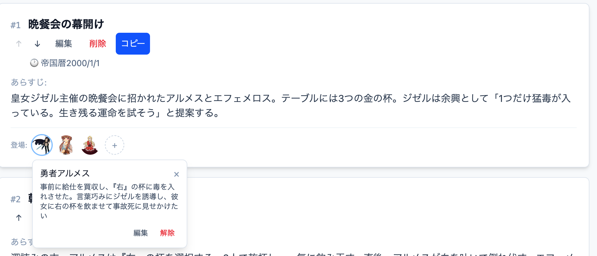
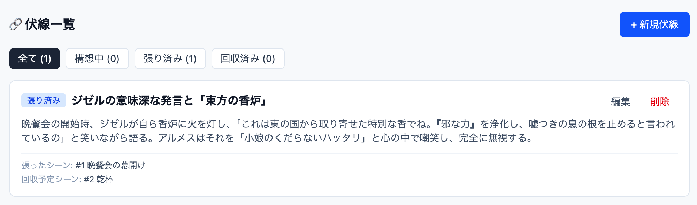
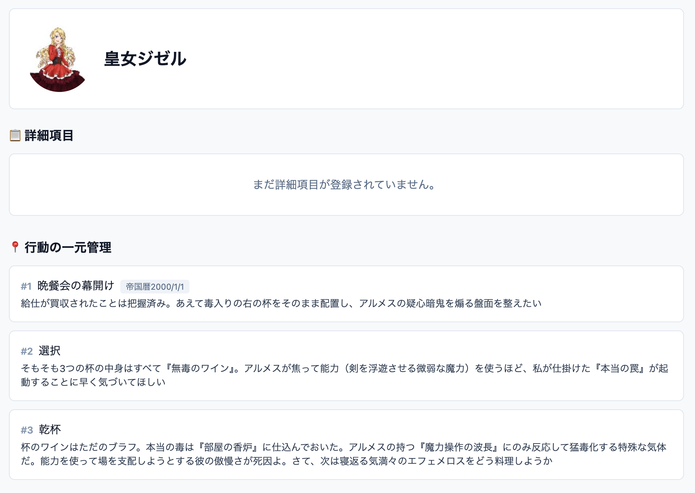

# さっかのあめ-執筆支援ツール-

https://wri-sup.pages.dev/

### このツールの目的

組織、個人問わずあらゆる創作のシナリオにおいて、「エタり」「設定の破綻」は最大の敵です
「さっかのあめ」はそれらを防ぎ、創作物を一つレベルアップさせます

## 複雑なストーリーが一目で
ストーリーとキャラ、それぞれの思惑を管理

## 伏線を可視化
読者も作者もスッキリ

## キャラの行動を一元表示して矛盾チェック
魅力的で一貫したキャラクターを作れる

##  機能一覧
- 複数の作品、それぞれのシーンやキャラクターを登録・管理
- 作品ごとに「ゴール」「テーマ」を設定
- 各シーンに登場キャラを登録
- 各キャラの登場シーンまとめ
- 全シーンをテキストとしてクリップボードにコピー
- 伏線の可視化、状態管理

##  技術スタック
- フロントエンド | Vue 3 , TypeScript 
- ビルドツール | Vite 
- データベース | IndexedDB (Dexie.js) 
- ホスティング | Cloudflare Pages 

##  今後の展望 
- 複数デバイスでのデータ登録機能
- キャラクター間の関係性整理機能
- 要望などがあれば https://x.com/wrisupEX まで-
