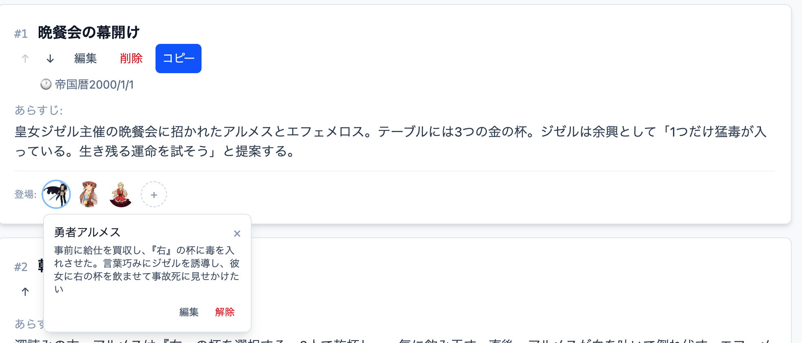
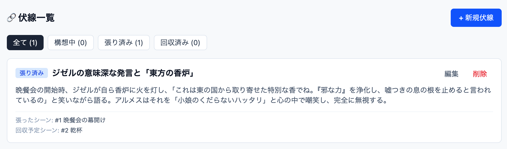
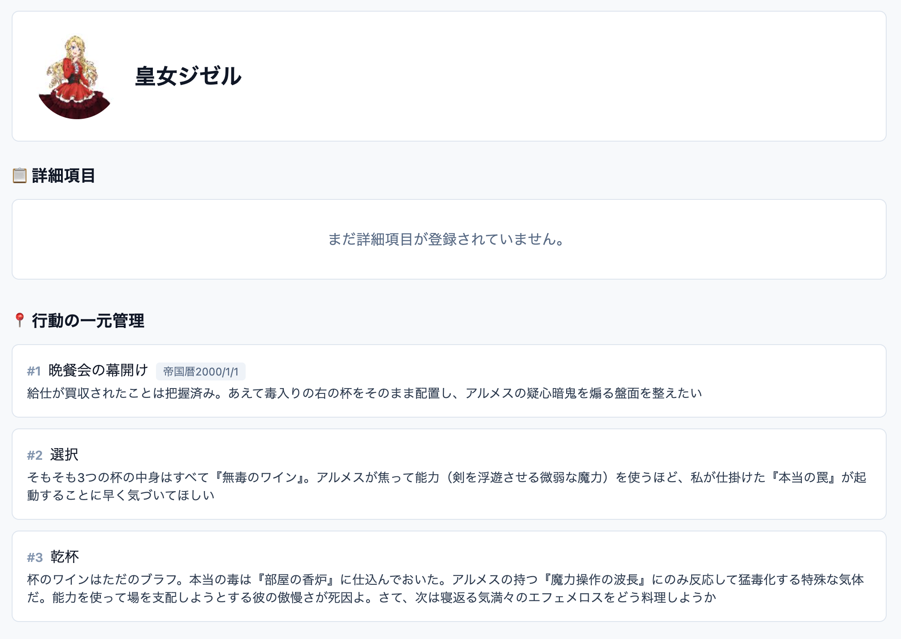

# さっかのアメ-執筆支援ツール-
https://wri-sup.pages.dev/（オフライン版）
https://wso.pages.dev/（オンライン版）

### このツールの目的

組織、個人問わずあらゆるシナリオにおいて、「エタり」「設定の破綻」は最大の敵です
「さっかのアメ」はそれらを防ぎ、創作物を一つレベルアップさせます
オフライン版はフロントエンドのみで動作するため、非常に手軽に扱え、AIに学習される恐れもありません

## 複雑なストーリーを1ページで管理
ストーリーとキャラ、それぞれの行動を管理

## 伏線を可視化
読者も作者もスッキリ

## キャラの行動を一元表示して矛盾チェック
魅力的で一貫したキャラクターを作れる

##  機能一覧
- 複数の作品、それぞれのシーンやキャラクターを登録・管理
- 作品ごとに「ゴール」「テーマ」を設定
- 各シーンに登場キャラを登録
- 各キャラの登場シーンまとめ
- 全シーンをテキストとしてクリップボードにコピー
- 伏線の可視化、状態管理

##  技術スタック
- フロントエンド | Vue 3 , TypeScript 
- バックエンド | TypeScript 
- ビルドツール | Vite 
- データベース | IndexedDB (Dexie.js) 、D1
- ホスティング | Cloudflare Pages

## 制作環境
- 開発者:個人開発
- 開発期間：6週間程度
- 開発の動機:自分自身がキャラクターの管理に苦労した経験や、追いかけていた作品の更新が止まった経験から

## 今後の展望
- web小説執筆により適応するため、以下のサイトの特殊記法に対応
    - 小説家になろう
    - pixiv
    - ハーメルン
    - カクヨム
- 並行して特殊記法使用時のプレビュー機能実装
- 創作効率向上のため、「三幕構成」「ヒーローズ・ジャーニー」などの作法を活かした章分け機能