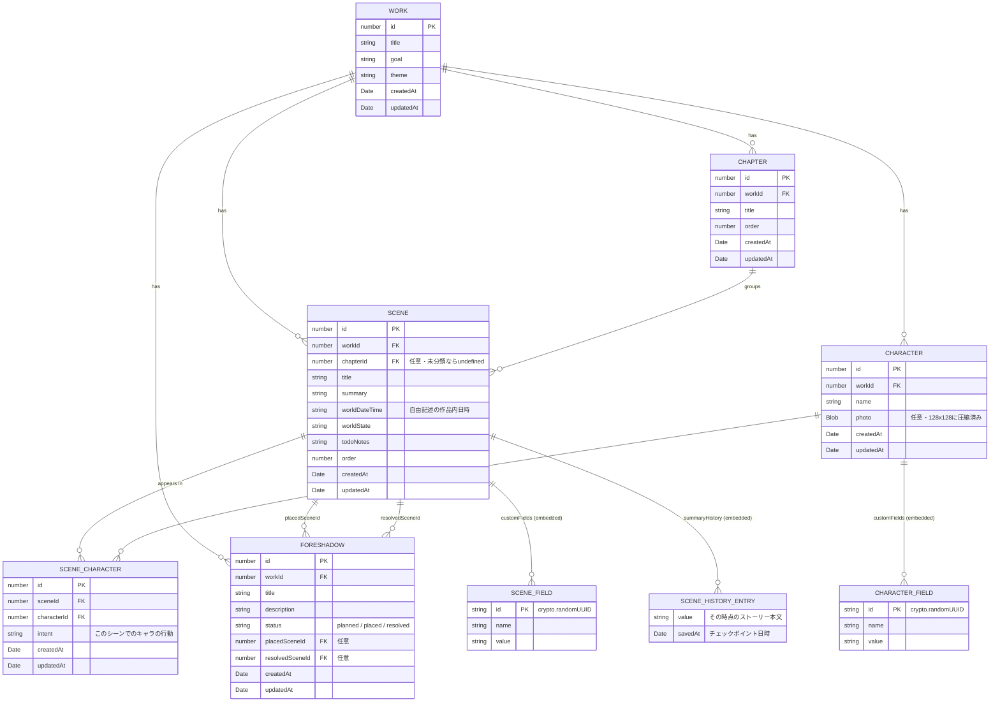

# さっかのアメ データ構造(2026/7/12)

さっかのアメ はブラウザ内 IndexedDB(Dexie)にすべてのデータを保存する。
`src/db/index.ts` で定義されたテーブルと、`src/types/*.ts` の型定義をもとにしたER図。

## ER図

## 補足

- `SCENE_FIELD` / `SCENE_HISTORY_ENTRY` / `CHARACTER_FIELD` は独立した Dexie テーブルではなく、
  `Scene.customFields` / `Scene.summaryHistory` / `Character.customFields` として **配列でそのまま埋め込み保存**されている(JSON扱い)。
- 日付を持つフィールドは全テーブル共通で `createdAt`(作成日時)・`updatedAt`(最終更新日時)。
  `SCENE_HISTORY_ENTRY` のみ `savedAt`(ストーリー本文のチェックポイントを取った日時、入力停止3秒後に自動記録)を持つ。
- `Chapter` / `Scene` は `order` フィールドで作品内の並び順を管理(番号の入れ替えでソート)。
- `Foreshadow.status` は `planned`(構想中)→`placed`(張り済み)→`resolved`(回収済み)と遷移する。

## テーブル定義の変遷(`src/db/index.ts` の Dexie バージョン)

| version | 追加内容 |
| --- | --- |
| 1 | `works` テーブルを新規作成 |
| 2 | `scenes` テーブルを追加 |
| 3 | `foreshadows` テーブルを追加 |
| 4 | `characters` テーブルを追加 |
| 5 | `sceneCharacters`(シーン⇔キャラの多対多、複合インデックス)を追加 |
| 6 | `chapters` テーブルを追加し、`scenes` に `chapterId` インデックスを追加 |

*(Dexie のバージョン定義自体には作成日の記録がないため、上表は追加順のみを示す)*
